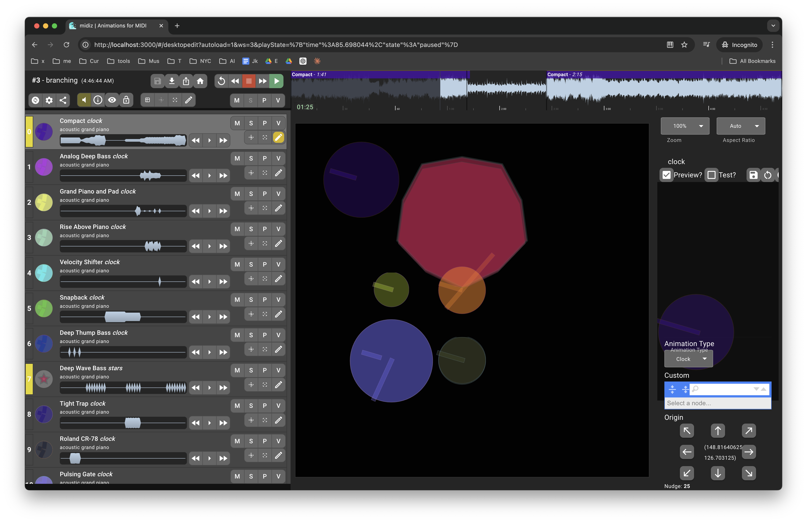

# midiz

This is an editor for music visualizations. The app is [here](./app) and here are a few rough examples:

- [youtu.be/Tjr9BFnCHDQ](https://youtu.be/Tjr9BFnCHDQ)

    <iframe width="560" height="315" src="https://www.youtube.com/embed/_Sy9wmFlmvM?si=xAWQtkOcOHcZu4mD" title="YouTube video player" frameborder="0" allow="accelerometer; autoplay; clipboard-write; encrypted-media; gyroscope; picture-in-picture; web-share" referrerpolicy="strict-origin-when-cross-origin" allowfullscreen></iframe>

- [youtu.be/Tjr9BFnCHDQ](https://youtu.be/Tjr9BFnCHDQ)

    <iframe width="560" height="315" src="https://www.youtube.com/embed/Tjr9BFnCHDQ?si=74rF3TZg407rBkzb" title="YouTube video player" frameborder="0" allow="accelerometer; autoplay; clipboard-write; encrypted-media; gyroscope; picture-in-picture; web-share" referrerpolicy="strict-origin-when-cross-origin" allowfullscreen></iframe>

The editor itself currently looks like this:

] 