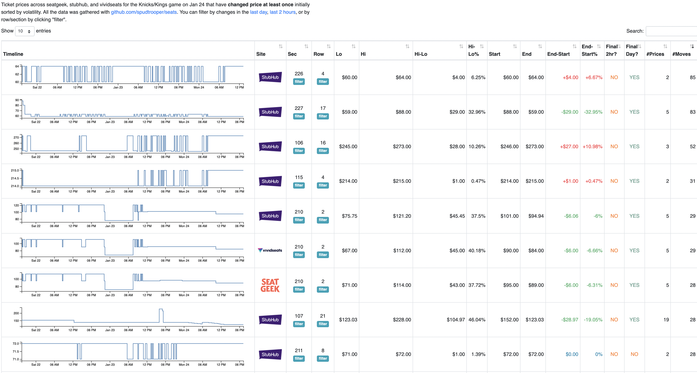

# seats

I like to look at ticket prices and have a couple play projects around that:

* [ticketloob.com](https://ticketloob.com)
* [ticketmixer.app](https://ticketmixer.app)

I've also used this to track prices over time, e.g.

* [2022 US Open Final](us_open_final) - 2022 US Open Final
* [2022 US Open Men's Final](us_open_mens_final) - 2022 US Open Men's Final
* [Super Bowl LVI](super_bowl_lvi) - see people [dump superbowl tickets](https://spudtrooper.github.io/seats/super_bowl_lvi/?lastDay) on the last day.
* [A Knicks/Kings game](knicks_kings) - also see this [version](./Knicks-Kings.html)

## Why?

I went to the Knick/Pelicans game on Jan 20 at the last minute and noticed that the price for some floor tickets had dropped dramatically, and I was wondering whether this was a fluke or the norm. It appears like this maybe, kind of, sort of is the norm? I don't know?
